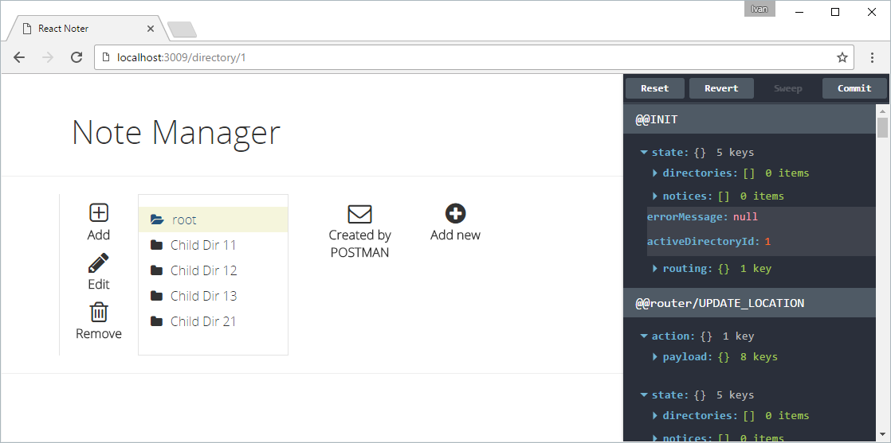

# React Noter

Just a simple app for learning purpose.

## Installation
Run `npm install` to install all dependencies.

## Running
Run `npm start`. This will run two servers

1. ~~on **3001** port - few REST endpoints - e.g.: http://localhost:3001/directories~~
**BE is not here**
2. on **3009** port - React application

Run this url in your browser

`http://localhost:3009/directory/1`

and you should see this:




## Description for devs
This application is written with **React** and uses **Redux** as a **Flux** architecture implementation.
**Webpack** is used as a module bundler, ES6 to ES5 compiler (Babel).
And for styling I'm using **Bootstrap**, **bootstrap-loader** and CSS-modules for convenience.


### Used packages and helpers
* `bootstrap-loader`

### Project structure
```
/app - source code
 |-/actions
 |-/components - "dumb" components
 |-/containers - "smart" components
 |-/reducers
 |-/store
 |-/styles
```

